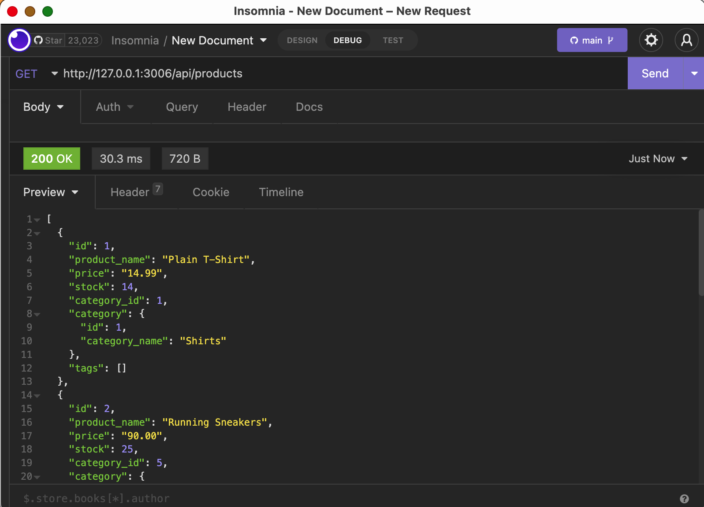
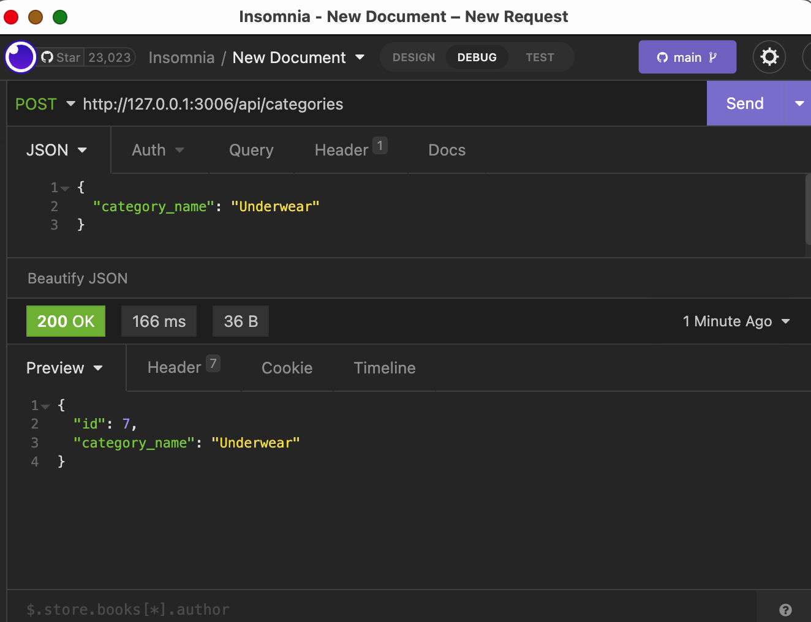

# Challenge-13-eCommerce-Backend
The student assignment of the ESMT Coding Boot Camp is to build the backend for an e-commerce site, using Express.js, Sequelize, and a MySQL database. The assignment was completed with a test of CRUD operations using Insomnia and a video submission showing the results. 

## Snapshot
The following images and videos show the Insomnia tests of GET route for products and PUT route for categories.

## Challenges
* Use starter code for a functional Express.js API  
* Connect to a MySQL database with Sequelize  
* Build tables with Sequelize database model structure  
* Create "include" associations between models  
* Fill in CRUD operations on product-, tag-, and category routes
* Use Insomnia to test CRUD routes  

## Thanks to
* [Xander Rapstine](https://github.com/Xandromus) for the assignment [starter code](https://github.com/coding-boot-camp/fantastic-umbrella)  
* [Tiffany Conroy](https://github.com/theophani) for the walk-through of the assignment and starter code  

## Contact
Tammi L. Coles (@tlcoles)  
GitHub repo: https://github.com/tlcoles/Challenge-13-eCommerce-Backend  